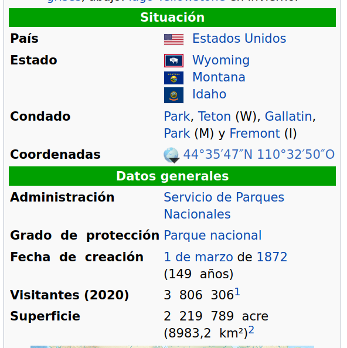
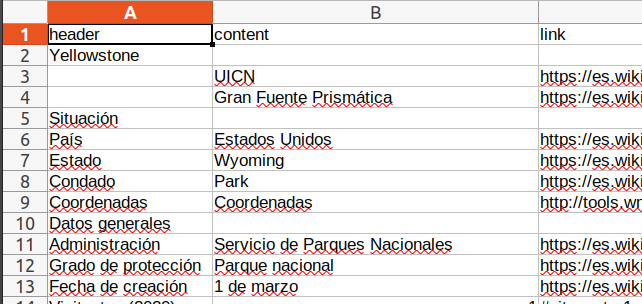
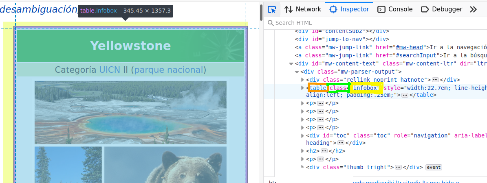

# Proyecto para scraping

## Objetivo

Nuestra página web de prueba será: (https://es.wikipedia.org/wiki/Parque_nacional_de_Yellowstone)

Queremos parsear la tabla de información de wikipedia.



De esta forma podemos extraer los datos principales de cualquier página web de wikipedia.

### Resultado

Queremos exportar los datos a un fichero [CSV](https://es.wikipedia.org/wiki/Valores_separados_por_comas), que es como un tipo de Excel, una tabla de valores básicamente.

El resultado del ejemplo es:



## Pasos

1. Instalamos el paquete "scrapy": `pip3 install scrapy`
2. Ejecutamos comando `scrapy runspider wikipedia.py -o resultados.csv`
3. Abrimos el fichero `tabla.csv` donde podemos ver los datos:


## ¿Cómo ocurre el parseo?

El fichero `wikipedia.py` realiza el parseo.

Podemos ver la URL a la que hace referencia:

```python
    start_urls = [
        'https://es.wikipedia.org/wiki/Parque_nacional_de_Yellowstone',
    ]
```

Queremos escoger esta tabla de aquí



Naranja: Tag HTML **tabla** *table*
Verde: Propiedad del elemento *class*
Amarillo: Nombre de la clase = `infobox`

De este análisis vamos analizando los resultados.

```python

    def parse(self, response):
        for row in response.xpath('//table[contains(@class, "infobox")]/tbody/tr'):

```

Este parser utiliza una especificación llamada [XPATH](https://es.wikipedia.org/wiki/XPath)
que nos permite buscar, navegar y filtrar datos.

 
## Bibliografía

Documentación: 
- (https://docs.scrapy.org/en/latest/intro/tutorial.html)
- (https://scrapy.org/)

Ejemplos:
- (https://github.com/scrapy/quotesbot/tree/master/quotesbot/spiders)
